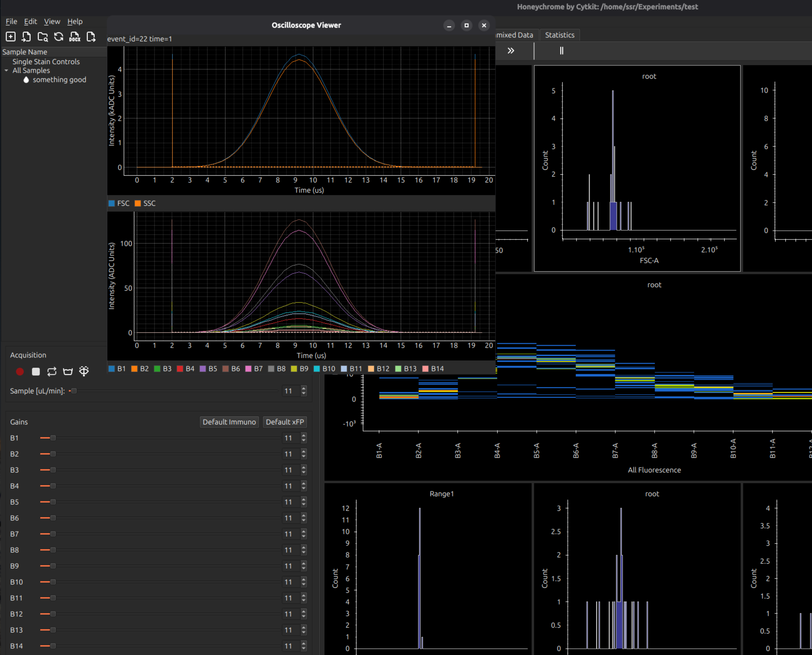

[Cytkit](https://cytkit.com) | [Honeychrome](https://honeychrome.cytkit.com/) 
---

#  Honeychrome

[Overview and Installation](./) | [Acquire Data](./docs/acquisition.md) | [Spectral Analysis](./docs/spectral_analysis.md) | [AutoSpectral in Honeychrome](./docs/autospectral_in_honeychrome.md) | [Conventional Analysis](./docs/conventional_analysis.md) | [Manipulate Plots and Gates](./docs/cytometry_plots_and_gates.md) | [Reports, Exports & Sample Comparison](./docs/reports.md) | [User Interface Guide](./docs/user_interface_guide.md) | [File Format](./docs/file_format.md) | [Programming and Plugins](./docs/programming_plugins.md)

# Honeychrome provides an acquisition interface
Honeychrome provides an interface for acquiring data on cytometry instruments:
- acquisition / flow control
- detector gains
- oscilloscope view for raw traces and to inspect live peak detection

Honeychrome contains drivers for Cytkit (coming soon).

