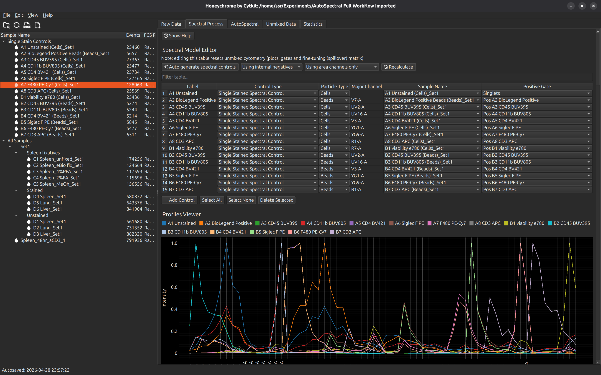
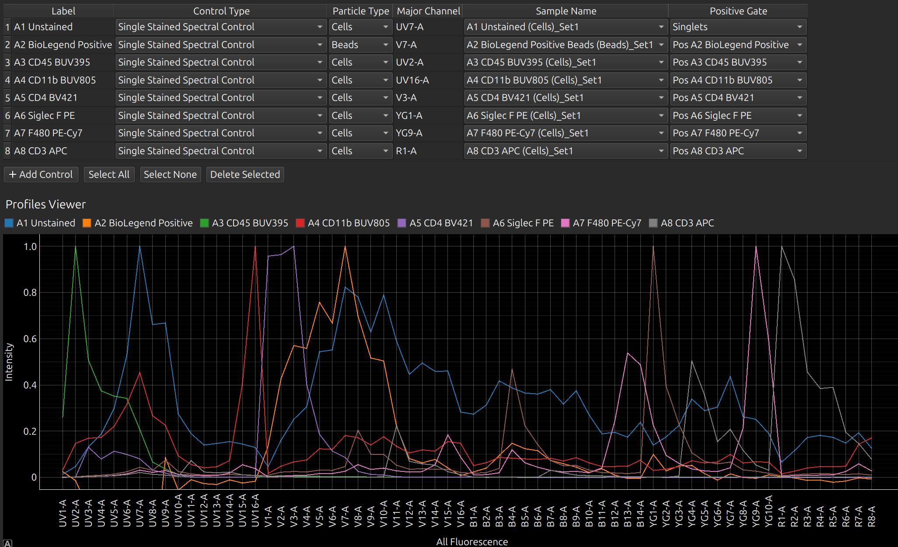
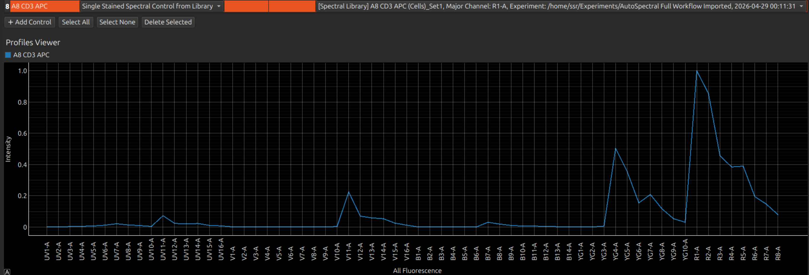
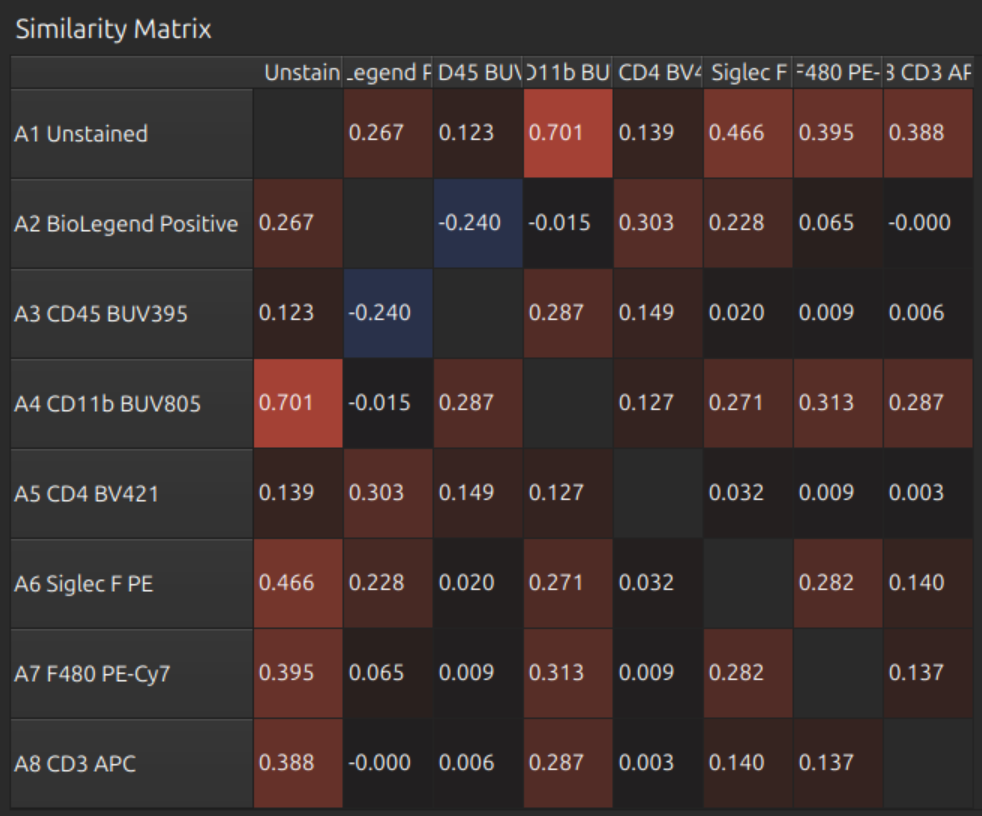
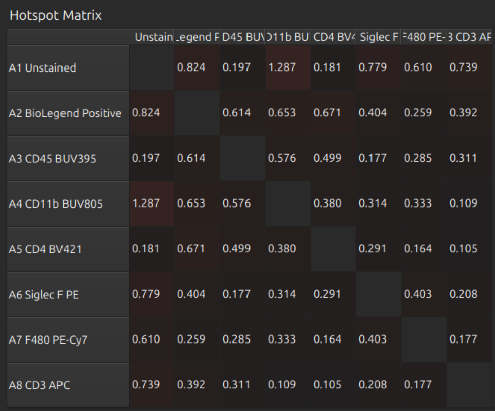
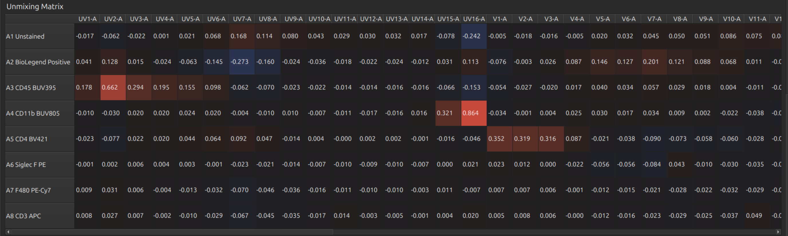
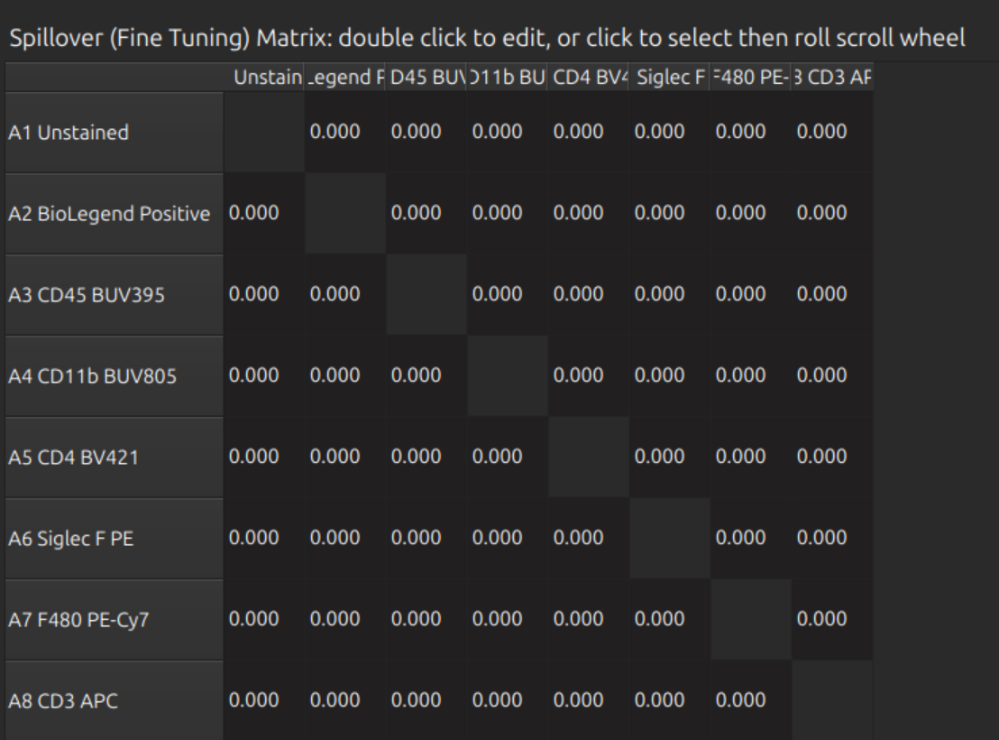
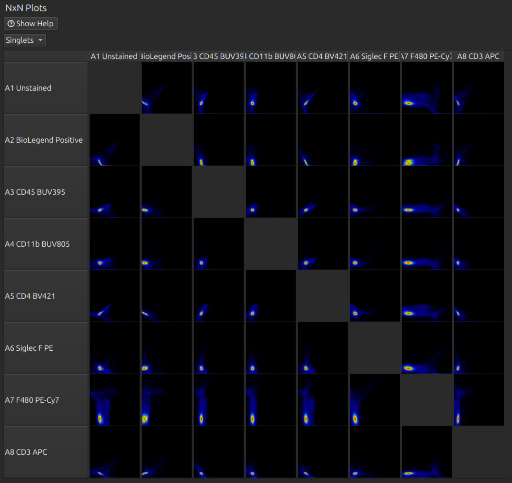
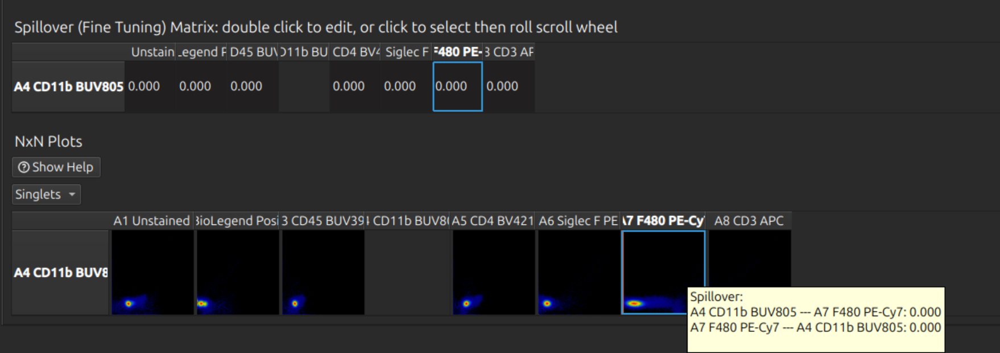
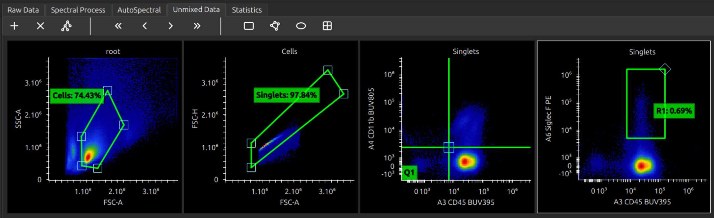

[Cytkit](https://cytkit.com) | [Honeychrome](https://honeychrome.cytkit.com/) 
---

#  Honeychrome



# How to analyse spectral cytometry data in Honeychrome
This guide assumes you have already installed Honeychrome using the [executable installers (Windows/Mac/Linux) or Python (cross-platform)](./readme.md), and that you have a set of FCS files to import. We will be using a 9-colour panel run on a 5-laser Cytek Aurora from the [AutoSpectral Full Workflow Example](https://www.colibri-cytometry.com/post/autospectral-full-workflow-example). If you wish to follow this example, download the data from [Mendeley Data](https://www.colibri-cytometry.com/post/autospectral-full-workflow-example) and unzip.

{:toc}

## Create a new Experiment file
Run Honeychrome and select New Experiment. Type "AutoSpectral Full Workflow Example". This creates a .kit file with the experiment metadata and a folder of the same name to organise the FCS files and exports.

## Import your FCS files
Go to File menu > Import FCS Files, which brings up the following dialog window. You can either copy/move your FCS files into the experiment's Raw subfolder, or create a link to an existing data folder.

After dragging the data into the Raw subfolder, you should see these files:

You must also tell Honeychrome where the single stained controls are located. Open Experiment Settings (from the dialog or from menu Edit > Experiment Settings) and click on single stained controls to choose the correct folder. Here it is for this example:

Click Update Experiment Configuration at the bottom of the dialog, which will update your experiment metadata and check that the channels in the FCS files thatt you provided are consistent.

## Check raw cytometry
You can now browse your raw data. Click on any sample in the Sample Browser (left pane) to load the data. A full set of morphology plots, a ribbon plot and histograms are provided.

> **Tip:** You can add and manipulate gates, but don't attempt to do your analysis yet! You must first set up a spectral model so that you can work with the unmixed data. 
> 

## Build spectral model, unmix and fine tune

Select the Spectral Process tab. In this example, we will just press "Auto generate spectral controls", which takes all the FCS samples in the Single Stain Controls folder and calculates its profile. The default profile is the average intensity of the brightest events within the sample, minus an internal negative control (the dimmer events in the same sample). 

> **Tip:** You can alternatively use an unstained negative control: make sure first that one sample has a name containing the word "unstained" (case insensitive) and that you have defined gates Neg Unstained and Pos Unstained.

In this example, there are duplicate cell and bead controls. Select the bead controls and press the button "Delete Selected". You should now have the following controls in the spectral model editor. You can rename the labels at this point, or go back to the raw and adjust the gates that were set up automatically to define these controls.

If a control has failed, you can use a previous control of the same name. From Control Type, select Single Stained Spectral Control from Library. The library is a database (in your Experiments folder) of all the previous spectral profiles that you have processed in Honeychrome.

> **Tip:** Selecting one or more controls shows only these in the spectral viewer (and lines of the matrices below), which makes it easier to work with large panels.

Now press Select None (or Select All) so we can see all profiles and the full matrices below:
- Similarity Matrix
- Hotspot Matrix
- Unmixing Matrix

These look reasonable.

You can do fine tuning with the spillover matrix and/or the NxN plots:

> **Tip:** If you have a large panel, don't waste time doing this on the full set - it is slow and difficult to find the right row. Click one or more labels in the spectral model editor first, so that you can see the relevant rows and hide the others. Click on the relevant cell before rolling the mouse wheel to adjust fine tuning:

## Analyse unnmixed cytometry
You can now analyse your unmixed data. Manipulating plots and gates should hopefully be intuitive, but here are [some instructions](./docs/cytometry_plots_and_gates.md).

## Further instructions: 
- [Manipulate Plots and Gates](./docs/cytometry_plots_and_gates.md)
- [AutoSpectral in Honeychrome](./docs/autospectral_in_honeychrome.md) 
- [Reports, Exports & Sample Comparison](./docs/reports.md)
